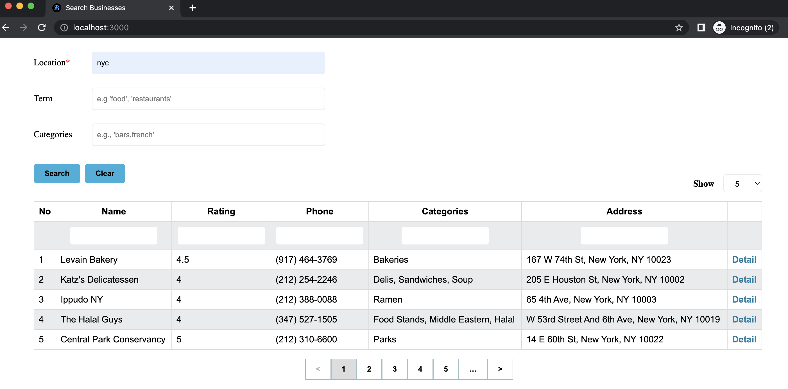
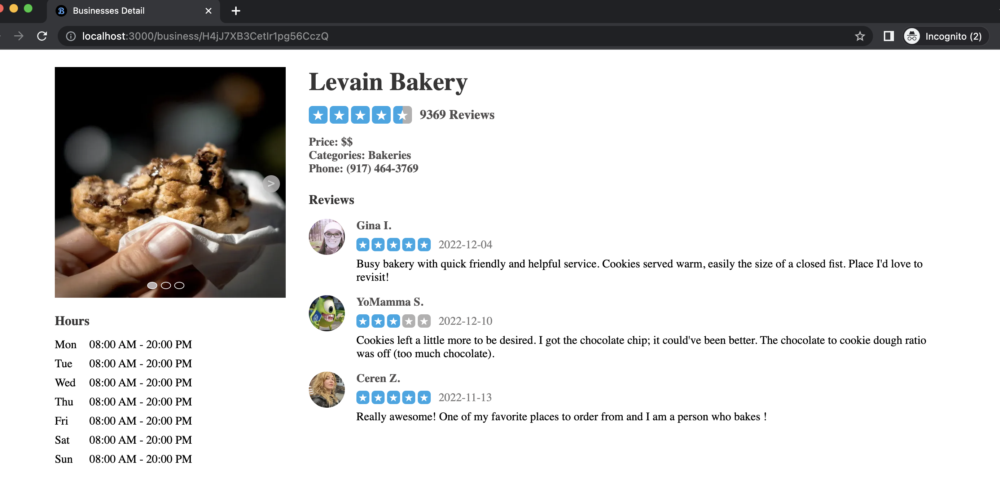

# Search Businesses

Search for businesses by using [the Yelp Fusion API](https://docs.developer.yelp.com/reference/v3_business_search)

## Running Locally

Open your terminal (cmd, git bash and so on)

Clone this repository by:

```
git clone https://github.com/rismawtsa/62teknologi-senior-frontend-test-rismawati-lasa.git
```

Change the directory:

```
cd 62teknologi-senior-frontend-test-rismawati-lasa
```

Install the dependencies:

```
npm install
```

Create the `.env.local` file from the `.env.example` file, and fill in the API key value. Please refer to the [authentication guide](https://docs.developer.yelp.com/docs/fusion-authentication) if you don't have the API key.

Running the application on the development:

```
npm run dev
```

The output on the terminal looks very similar to this:


Open your browser and enter `http://localhost:3000`.

## List



> Table columns, search fields, and page limits are configurable, you can change them by edit in the `constant.js` file.

## Detail


